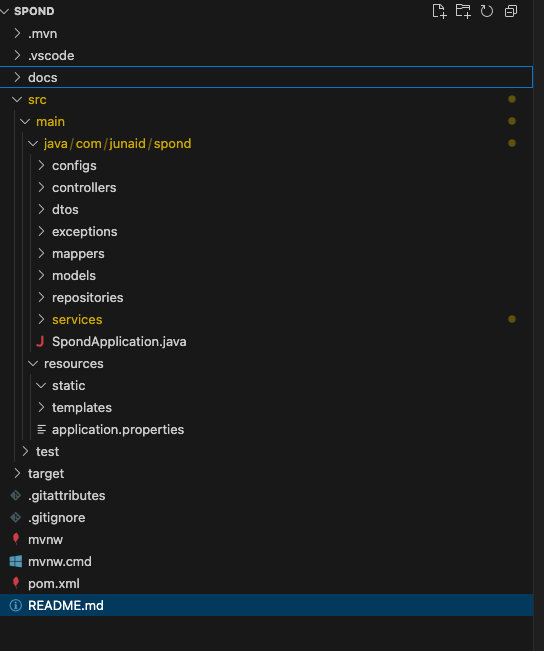
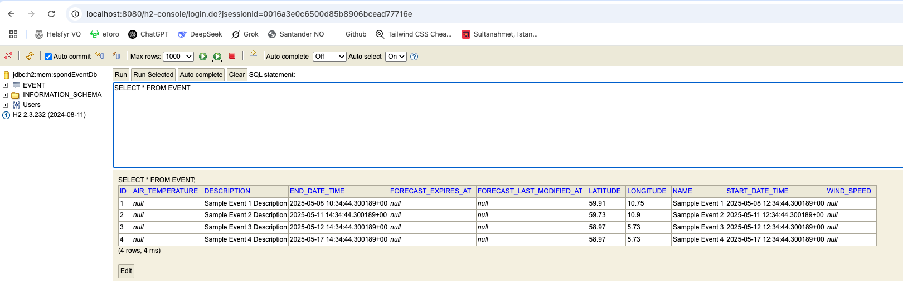
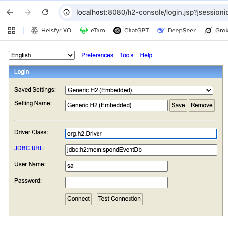

## Spong Event API

This is a simple API that manages events. The api fetches weather forecasts for the events using MET Weather API.

### Folder Structure



### Tech stack

- Java 21
- Maven
- H2 in-memory database

### How to Build

- From the root directory of the project, run

```shell
   ./mvnw clean install
```

### Formatting

- For formatting the code, we use spotless pluging.

```shell
    ./mvnw spotless::apply
```

### Running the test

```shell
 ./mvnw clean test
```

### Viewing test repost

- We use JoCoCo for test coverage

```shell
    ./mvnw clean verify
```

- It will create a JoCoCo coverage in target/site/jococo/index.html. Open it in a browser to view coverage report.

### Creating Executeable JAR

```shell
    ./mvnw clean package
```

- A JAR file will be generate under _target/_ path.

### Running the app using the JAR file

```shell
    java -jar target/{name_of_jar_file}
```

- A tomcat server should start on port 8080 that is ready to accept the request.

### Running the app from IDE

- run the _main_ method from SpondApplication.java file

### Default Seed Data

- When the app is running, by default it will create 4 sample events as shown in the screenshot. (startDateTime and endDateTime may vary)
  
- Event 1 is in the past
- Event 2 and Event 3 are within 7 days
- Event 4 is after 7 days

### Viewing the event list

- Using Postman or a browser, send a (GET) request to _http://localhost:8080/api/events_

- Response

```json
{
    "data": [
        {
            "id": 1,
            "name": "Sampple Event 1",
            "description": "Sample Event 1 Description",
            "latitude": 59.91,
            "longitude": 10.75,
            "startDateTime": "2025-05-09T21:15:47.091898Z",
            "endDateTime": "2025-05-09T19:15:47.091898Z",
            "airTemperature": null,
            "windSpeed": null
        },
        ...
    ],
    "currentPage": 0,
    "totalPages": 1,
    "totalItems": 4
}
```
**Note**: The above endpoint returns paginated response. You can append **page** and **size** query parameter for customization.

### Viewing an Event details

If you have the id of an event, you can view the event details. If the event is within next 7days, forecast data will be fetched. Otherwise, they will be null.

- Send a GET request to _localhost:8080/api/events/{id}_
- A response similar to this will be returned

```json
{
  "id": 2,
  "name": "Sampple Event 2",
  "description": "Sample Event 2 Description",
  "latitude": 59.73,
  "longitude": 10.9,
  "startDateTime": "2025-05-11T12:34:44.300189Z",
  "endDateTime": "2025-05-11T14:34:44.300189Z",
  "airTemperature": 15.1,
  "windSpeed": 3.3
}
```

_NOTE_: a valid event id is required for fetching event details, othewise a 404 NOT_FOUND error will occur with following data:

```json
{
  "title": "Resource Not Found",
  "status": 404,
  "message": "Event not found",
  "httpMethod": "GET",
  "path": "/api/events/5",
  "occurredAt": "2025-05-09T14:49:14.667508"
}
```

### Creating new event

- Using Postman or curl, new events can be created
- Make a POST request to _localhost:8080/api/events_ using following payload:

```json
{
  "name": "My event",
  "description": "Event description",
  "longitude": 59.9139,
  "latitude": 10.7522,
  "startDateTime": "2025-05-10T10:30:00Z",
  "endDateTime": "2025-05-10T12:30:00Z"
}
```

**NOTE**: name, startDateTime and endDateTime are mandatory fields. If one of these field is missing, a 400 BAD_REQUEST with fowllowing validation error will be returned

```json
{
  "title": "Validation Failed",
  "status": 400,
  "message": "Input validation failed",
  "httpMethod": "POST",
  "path": "/api/events",
  "occurredAt": "2025-05-09T14:51:12.373879",
  "errors": {
    "name": [
      {
        "code": "NotBlank",
        "message": "Name is required"
      }
    ]
  }
}
```

### Connecting to database

- We are using H2 in-memory database for this app.
- When the app is running, visit **http://localhost:8080/h2-console/**
- You will see something like this:



Update Driver Class and JDBC URL values as shown in the screenshot above then click Connect button.

### Deploying on Cloud

#### Manual

- Generate JAR file as mentioned in above stag
- Create an environment on the cloud eg. AWS E2 Instance
- Install java on the environment
- Upload the JAR file to the environment
- Run java -jar jar_file_name.jar --server.port:=80
- (optional) - create a service script to easity start/stop the app

#### Using CI/CD pipelines

- Setup any CI/CD tools such as Jenkins, Github Actions etc to automate the deployment process.

### Future developments

- secure the app by adding user authorization and authentication
- add endpoint to fetch paginated list of upcoming events near you
- add endpoints to update and delete events
- containerize the application
